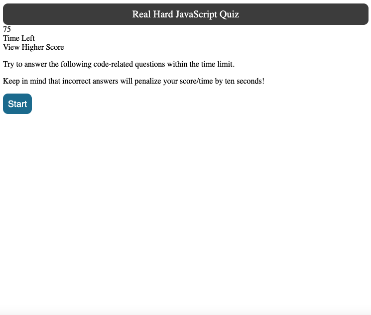

# 04 Web APIs: realhard-JavaScript-quiz


## Purpose:
---
```
Apply JavaScript knowledge with HTML basic function and CSS style to create an interactive code quiz.
```


## Thinking Process:
---
```
<!-- // GIVEN I am taking a code quiz
Okay, so it sounds like I am making a website where the user will take a quiz. That means there will be multiple question and answer groups to ask the user. Those questions and answers should be grouped in some sort of data structure with each other. 

// WHEN I click the start button
I need to have a button on the HTML page. Then the JavaScript has to listen for an event to happen. That event is the user clicking on it. This button click is what makes the quiz start. 

// THEN a timer starts and I am presented with a question
Okay, so now I have to make some code that starts a timer. How would I write a function that starts a timer to countdown every second? Hmm... Then my first question and answer choices need to show up on the screen. How can I use JavaScript to make things appear on the HTML? -->

GIVEN I am taking a code quiz
WHEN I click the start button
THEN a timer starts and I am presented with a question
WHEN I answer a question
THEN I am presented with another question
WHEN I answer a question incorrectly
THEN time is subtracted from the clock
WHEN all questions are answered or the timer reaches 0
THEN the game is over
WHEN the game is over
THEN I can save my initials and my score
```


# CODES
## HTML:
```
* Created basic format for code quiz
* Applied class and id for specific section
* Combined same property for class id 
```


## CSS:
```
* Applied font-family, font-size, font-style to words
* Applied background-color to specific area
* Applied flexbox, flex-direction, and flex-wrap in css
* Applied similar elements from the referecne image for this assignment
* Combined same property for same image property
```
## JavaScript:
```
* Variables
* var Interval
* var timeleft
* addEventListener
* querySelector
* getElementById
* function startGame()
* function builtQuiz() 
* function showResults() 

```


## Deployed Image:



---
## Images Use: 

![This website includes ] ![Joyce's website screenshot can be found here.]

(./assets/images/codequiz-screenshot-1.png)
(./assets/images/codequiz-screenshot-2.png)

---

## Required to submit the following URL for review:

* Github URL: 
https://github.com/Joyce750526/realhard-JavaScript-quiz

* Github Deployed Page: 
https://joyce750526.github.io/realhard-JavaScript-quiz/


---
Chao-Ying (Joyce) Chen


